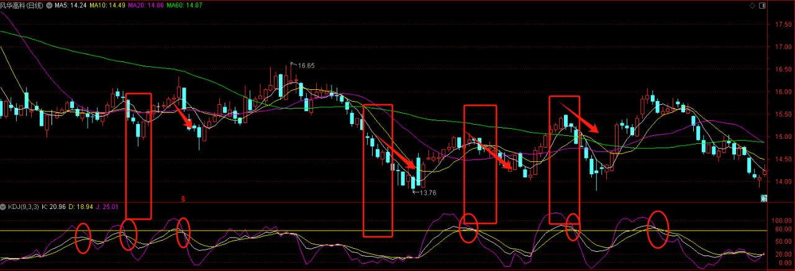
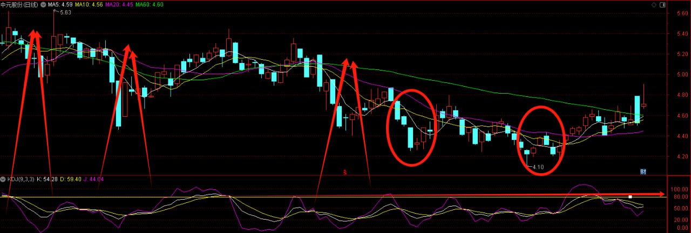
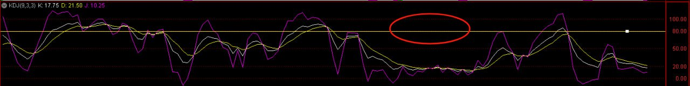
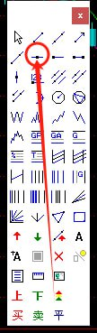
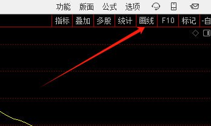
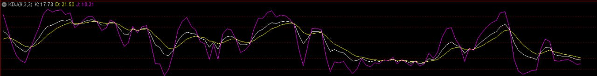
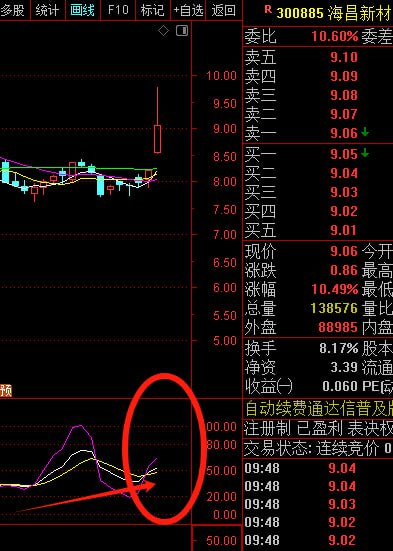

# KDJ小技巧

<!-- 文档转换自: KDJ小技巧.docx -->
<!-- 转换时间: 2025-08-25 20:01:28 -->
<!-- 提示: 文档中的关键数据已使用data-number类标记 -->

## KDJ指标参数设置与使用方法

根据当下市场，以下是一份实用的KDJ小技巧，可以帮助明确判断个股的进出决定。

### 基本设置

打开KDJ指标，设置参数为9,3,3。

### 关键点标记

1. 打开画线功能
2. 手动添加一条水平参考线到80位置
3. KDJ是超买超卖型指标，将80作为临界点

## 实战应用技巧

### 卖出时机判断

以股票代码000636为例，观察到每次KDJ达到80的临界点时，股价通常会出现下跌。

### 买入时机选择

- 选择KDJ在50附近的股票
- 确保尚未到达80超买区
- 观察底部是否形成三线拐头向上的形态
- 在50附近介入，短期获利2-5个点的概率较大

### 操作原则
- 当KDJ超过80时，考虑卖出
- 当KDJ在80以下时，可以继续持有或买入
- 此方法特别适合短线操作

## 指标特性与局限性

KDJ指标是一种稳健的操作参考工具：
- 按照指标操作极少出现亏损
- 可能会错过某些强势股（妖股）的机会
- 任何指标都具有一定的延后性
- 指标只能作为辅助工具，不能决定一切

## 学习建议

跟着专业老师学习投资时的关键要点：
- 积极与老师交流，让老师记住你
- 在老师分享课程时及时提问，解决疑惑
- 实践是检验技术的最佳方式

## 图表示例

